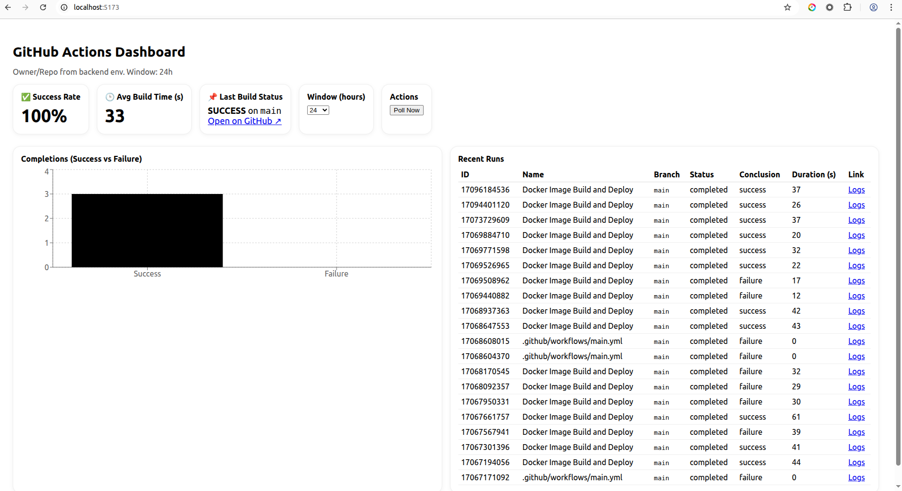

# 🚀 GitHub Actions Monitoring Dashboard

A self-hosted dashboard to **Monitor GitHub Actions Pipelines** with success/failure rates, build times, history, and Slack alerts through GitHub Actions.  
Built with **React (frontend)**, **Node.js (backend)**, **PostgreSQL (DB)**, and **Docker**.



---

## 📂 Repository Structure

```
.github-actions-dashboard/
├─ docker-compose.yml          # Orchestration of services
├─ .env.example                # Environment variable template
├─ backend/
│  ├─ Dockerfile
│  ├─ package.json
│  ├─ src/
│  │  ├─ index.js              # Server entry point
│  │  ├─ db.js                 # Database connection
│  │  ├─ github.js             # GitHub API integration
│  │  ├─ poller.js             # Polls workflow runs
│  │  ├─ metrics.js            # Metrics aggregation
│  │  └─ slack.js              # Slack alerts integration
│  └─ sql/
│     └─ init.sql              # DB schema initialization
└─ frontend/
   ├─ Dockerfile
   ├─ package.json
   ├─ vite.config.js
   ├─ index.html
   └─ src/
      ├─ main.jsx
      ├─ App.jsx
      └─ api.js
```

---

## 🏗️ Architecture Summary

- **Frontend** → Displays metrics, pipeline history, last build status.  
- **Backend** → Polls GitHub API, exposes REST APIs, sends Slack alerts.  
- **Database** → Stores workflow run history.  
- **Slack** → Notifies failures in real time.  

---

## ⚙️ Setup & Run Instructions

### 1️⃣ Prerequisites
- Docker & Docker Compose  
- GitHub Personal Access Token (**PAT**)
- (Optional) Slack Incoming Webhook URL  

---

### 2️⃣ Clone Repository
```bash
git clone git@github.com:iam-saurabh-bhale/health_dashboard.git
cd .github-actions-dashboard
```

---

### 3️⃣ Configure Environment

```env
# GitHub Settings
GITHUB_TOKEN=ghp_xxxxxxxx
GITHUB_REPO=your-org/your-repo

# Database Settings
DB_HOST=db
DB_USER=ga_user
DB_PASS=ga_pass
DB_NAME=ga_dashboard

# Slack Alerts (optional)
SLACK_WEBHOOK_URL=https://hooks.slack.com/services/xxx/yyy/zzz
```

---

### 4️⃣ Start Services
```bash
docker-compose up -d --build
```

This will start:
- 🐘 PostgreSQL (`db`)
- 🖥️ Backend API (`backend`)
- 🌐 Frontend UI (`frontend`)

---

### 5️⃣ Access the Dashboard
- UI → [http://localhost:5173](http://localhost:5173)  
- API → [http://localhost:8080](http://localhost:8080)  

---

### 6️⃣ Verify Setup

Check DB:
```bash
docker exec -it <db_container> psql -U ga_user -d ga_dashboard -c "SELECT * FROM runs;"
```

Check backend logs:
```bash
docker logs <backend_container>
```

Trigger a workflow run on GitHub → confirm it appears in the dashboard.  

---

## 📊 Features

- ✅ Success / Failure Rate  
- 🕒 Average Build Time  
- 📌 Last Build Status  
- 📜 Pipeline Execution History  
- 🔔 Slack Alerts for Failures  

---

## 🖥️ API Endpoints

- `GET /api/metrics` → Returns metrics summary  
- `GET /api/runs` → Returns run history  
- `POST /api/alerts` → Triggers Slack alert  

**Example Response (`/api/metrics`)**
```json
{
  "success_rate": 87,
  "avg_build_time": 210,
  "last_build": {
    "status": "success",
    "duration": 195,
    "timestamp": "2025-08-21T10:00:00Z"
  }
}
```
---

# How AI tools were used (with prompt examples)

## Steps Taken

- **Requirement Review**  
  Reviewed the provided document and understood the exact requirements.  

- **Feasibility Exploration**  
  Explored various dashboard solutions on the internet to verify if the requested tasks were possible.  

- **CI/CD Pipeline Setup**  
  Since building the CI/CD pipeline is the initial step for this dashboard, the repository name and CI/CD details were identified as inputs for the dashboard.  

- **AI Tool Exploration**  
  After creating the CI/CD setup, explored different AI tools to determine the best fit for local development on Ubuntu.  

- **Tool Selection**  
  Faced limitations with the Cursor tool (free version restrictions and installation issues on Ubuntu), so decided to continue with **ChatGPT UI** for development.  

- **Prompt Preparation**  
  Wrote a detailed prompt locally to clearly capture the requirements, aiming to generate the complete working code in a single attempt.  

- **Code Retrieval & Finalization**  
  Retrieved multiple versions of the code through ChatGPT conversations and finalized a working solution.  
  Earlier versions faced issues such as dependency on older Node.js versions or Docker build errors.  

## Prompt Used

The following is the one prompt was provided to generate the code:

```
Please assume that you are DevOps Engineer and you need to create one Dashboard for monitoring of the GitHub Action like Dora Dashboard.

In the Dashboard, the following will be monitored:

Collect data on pipeline executions (success/failure, build time, status).

Show real-time metrics:

✅ Success/Failure rate

🕒 Average build time

📌 Last build status

Send alerts (via Slack or Email) on pipeline failures.

Provide a simple frontend UI to:

Visualize pipeline metrics

Display logs/status of latest build

Should include:

Backend (Node.js/Python etc.)

Frontend (React/Vue or any)

DB (SQLite/PostgreSQL)

Alerting service integration

Deployment of this dashboard is through Docker.

# Learnings and Observations with AI  

## Overview  
AI represents the future of the 21st century. While it may not be essential for everyone, it is particularly important for IT professionals. I recognize the need to learn it soon, including understanding detailed use cases and exploring multiple tools.  
```
---

# Key Learnings & assumptions  

1. **AI and its importance**  
   - AI is shaping the future of technology.  
   - It is especially important for IT professionals to explore and adopt.  
   - Focus on learning detailed use cases and experimenting with different tools.  

2. **Exploring Canvas**  
   - Used **Canvas** to quickly identify and troubleshoot code errors.  
   - Ability to execute code directly within Canvas helps speed up debugging.  

3. **Best practices for prompts**  
   - Crafting prompts effectively leads to better results.  
   - Start by understanding and documenting requirements in detail before submitting a prompt.  

4. **Role-based prompting**  
   - Asking AI to assume a specific role (e.g., DevOps engineer) provides more context-aware and relevant solutions.  

5. **Code validation and troubleshooting**  
   - AI may not always generate fully functional code since it is still evolving.  
   - It’s important to identify and troubleshoot the errors.  
   - Example: A Dockerfile provided by AI had an issue which were resolved by analyzing logs, researching online and using AI assistance.  

6. **Iterative improvement**  
   - Performing multiple iterations of a task with small refinements leads to better results and outputs.  

7. **Common issues observed**  
   - Most issues occur on the **coding side**, especially with **version mismatches**.  
   - Example: Node.js version suggested was outdated, requiring updates to Node, `package.json`, and dependencies to ensure proper compilation.  

---

## Conclusion  
AI is a powerful enabler but not a one-click solution. Success lies in combining AI’s capabilities with critical thinking, iterative improvements, and troubleshooting skills to achieve accurate and reliable outcomes.  


